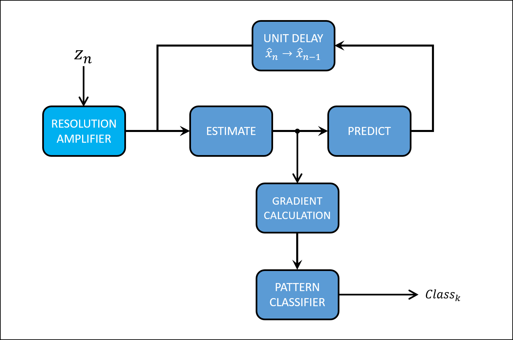

# Pattern Recognition for Leakage Detection in Hydraulic Systems

## Description:

A Machine Learning pipeline composed of a [`Kalman Filter`](https://en.wikipedia.org/wiki/Kalman_filter), an `Oriented Gradient` algorithm and a `Pattern Classifier` which is based on [`Hierarchical Clustering Analysis`](https://en.wikipedia.org/wiki/Hierarchical_clustering) is proposed. The model is designed to run recusively on a sample rate of **1 minute,** so can recognize different events in a hydraulic system and continuosly monitoring for anomaly detections such as _oil leakages_.

**Keywords: `Optimal Estimation,` `Feature Engineering,` `Pattern Recognition,` `Unsupervised Learning,` `Hierarchical Clustering`**

 

 
<i>Different patters found in a hydraulic system</i>

 

## Requirements:

- Python 3.9.7
- Pandas
- Numpy
- Matplotlib
- Scikit-Learn
- Scipy

## Hydraulic System:

In a **Hot Rolling Mill** the Hydraulic Power Unit is the main source of mechanical energy used by the mill's stands to perform the rolling process. In general terms, a Hydraulic System is a close system where the volume of oil supplied to the equipment always return to the main reservoir.

Even though this maybe simplify the monitoring of the volume in the system by measuring the level in the main reservoir, this can be difficult due to the configuration of the equipment, mainly from the hydraulic cylinders which is the main equipment used in the mill.

 
<i>Schematic of hydraulic power unit and hydraulic cylinders</i>

 

Due to its construction the bore width and the rod diameter take up much of the available volume in the _Rod End_ compartment given as a result that the volume of oil contained in the _Cap End_ compartment, when the cylinder is fully extended, exceeds 2 to 4 times the volume (`Area Ratio`), in the _Rod End_ compartment when the cylinder is fully retracted. This means, that the oil volume returned to the tank in a full-retracted operation will be 2 to 4 times the volume supplied, affecting the oil measurement through the level monitor in the reservoir (`LT`) in the form of uncertainties.

From a statistical point of view, we can think of these uncertainties as random measurements which can hide the true value of the system, and been necessary the use of an estimator for the hydraulic oil level measurement.

## Model Architecture:

The proposed model implements three main stages to:

- Estimate the current level state in the reservoir.
- Calculate the oriented gradient between the last state and the current state.
- Classify the gradient's magnitud and phase according with its pattern.

 
<i>Recursive model for pattern recognition in a hydraulic system</i>

 

## Kalman Filter:

The `Kalman Filter`` is a recursive algorithm that utilizes the **Measure, Estimate, and Predict** process where the measurements, current state, and next state estimation are normally distributed random variables.

 
<i>State estimation made by the Kalman Filter</i>

 

The Kalman Filter is an **optimal filter** which combines the previous state estimate with the measurement in a way that minimizes the uncertainty of the current state estimate.

## Oriented Gradients:

To quantify each possible event in the hydraulic system the state estimations made by the Kalman Filter were encoded as `Oriented Gradients,` where the magnitud and phase between the last and the current state were used.

 
<i>Oriented gradients for positive and negative events</i>

 

These **features** are selected to classify each event as a pattern.

## Pattern Classification:

To establish a classification of the oriented gradients a `Hierarchical Clustering Analysis` was performed to establish the optimun number of clusters to classify the oriented gradients into a pattern.

A **Dendrogram** was constructed to visualize the clusters with common magnitude and phase.

 
<i>Dendrogram for oriented gradients</i>

 

To maintain the maximum granularity for the classifier, **7 clusters** were selected to classify each pattern.

 
<i>Hierarchical Clusters</i>

 
